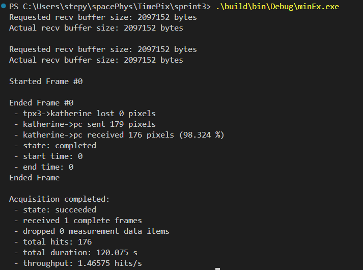

# SPRINT-3 Data Acquisition Software 

This repository contains the software for the Space Particle Radiation Identification with Novel Timepix-3 technology (SPRINT-3) Mission.

It builds on the [Katherine Control Library](https://github.com/petrmanek/libkatherine/tree/master/c) with slight modifications allowing for static linking.

## Building
To build and run the main program:

On Windows: 
`./build.ps1 [Flags...]` 
`./build/bin/<BuildMode>/sprint.exe <acq_time_seconds> [-v (for verbose)]`

On Linux: 
`./build.sh [Flags...]` 
`./build/bin/sprint <acq_time_seconds> [-v (for verbose)]`

Available Flags:
- -clean (cleans before rebuilding)
- -release (builds in release mode, debug is default)
- -test (builds test)

## Testing
To build and run tests: 

On Windows: 
`./build.ps1 -test` 
`./test.ps1`

On Linux: 
`./build.sh -test` 
`./test.sh`

## UDP Packet Drop Bug
Sporatically, a small number of UDP data packets from the HardPix to the PC are not recieved by the application.

Monitoring the connection with Wireshark indicates that the UDP packets are being received by the PC.

Example output from the minimal executable: 

To build and run the minimal executable:
1. Modify minimalEx.cpp to match the configurations required for your HardPix, and add your chip config to the core folder
2. Build the executable  
On unix systems: `.\build.sh -min`  
On windows systems `.\build.ps1 -min`
3. Run the executable
On unix systems: `.\build\bin\minEx`  
On windows systems: `.\build\bin\Debug\minEx.exe`