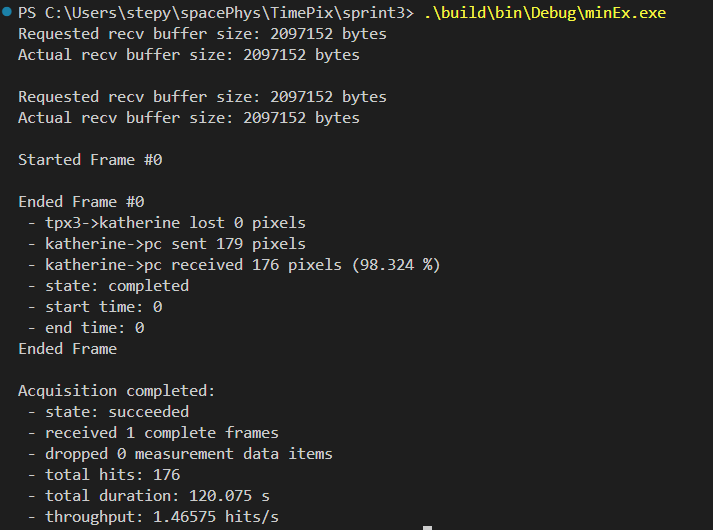

# SPRINT-3 Data Acquisition Software 

This repository contains the software for the
Space Particle Radiation Identification with Novel Timepix-3 technology (SPRINT-3) Mission.

It builds on the
[Katherine Control Library](https://github.com/petrmanek/libkatherine/tree/master/c)
with slight modifications allowing for static linking and timeout on absence of hits.

 
## Documentation
To build and read the docs, from the top level directory (sprint3), run: 
`doxygen Doxyfile`

Then open `docs/html/index.html` with your browser of choice.

 
## Building
To build and run the main program:

On Windows: 
`./scripts/build.ps1 [Flags...]` 
`.build/bin/<BuildMode>/sprint.exe <acq_time_seconds> [-v (for verbose)]`

On Linux: 
`./scripts/build.sh [Flags...]` 
`./build/bin/sprint <acq_time_seconds> [-v (for verbose)]`

Available Flags:
- -clean (cleans before rebuilding)
- -release (builds in release mode, debug is default)
- -test (builds test)

 
## Testing
To build and run tests: 

On Windows: 
`./scripts/build.ps1 -test` 
`./scripts/test.ps1`

On Linux: 
`./scripts/build.sh -test` 
`./scripts/test.sh`

 
## Known Issues and Workarounds

 
### Failure to Retrieve Chip ID (Chip ID is zero)
Due to a known firmware issue with the Katherine Readout Device, sometimes the HardPix
fails to respond with the proper chip ID, but instead responds with an all 0 chip ID.

This issue can be solved by powercycling the HardPix.
Our software automatically powercycles the HardPix in case of this issue.

 
### Failure to Retrieve Acquision Data
Rarely, the HardPix will fail to send *any* acquisition data, despite successfully
responding with its chip ID.

This issue can be solved by powercycling the HardPix.
Our software automatically powercycles the HardPix and restarts the acquision if more
than 60 seconds passes without receiving any data from the HardPix.

 
### UDP Packet Drop Bug
Sporatically, a small number of UDP data packets from the HardPix to the PC are not recieved by the application.

Monitoring the connection with Wireshark indicates that the UDP packets are being received by the PC.

Example output from the minimal executable (minimalEx.cpp): 

To build and run the minimal executable:
1. Modify minimalEx.cpp to match the configurations required for your HardPix, and add your chip config to the core folder
2. Build the executable  
On unix systems: `./scripts/build.sh -min`  
On windows systems `./scripts/build.ps1 -min`
3. Run the executable  
On unix systems: `.\build\bin\minEx`  
On windows systems: `.\build\bin\Debug\minEx.exe`

 
This bug has yet to be solved, but has minimal impact of application results.